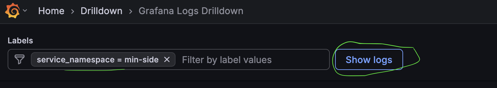
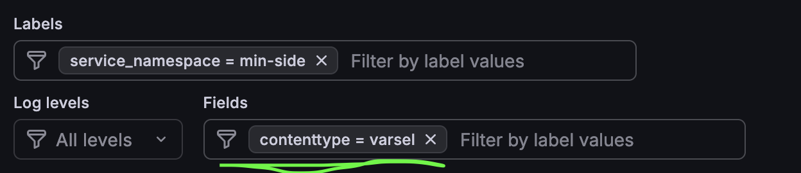

# Observability

Observability-pakken inneholder verktøy for å legge til MDC (Mapped Diagnostic Context) felt i logger for Ktor-applikasjoner. Dette gjør det enklere å filtrere og søke i logger i Grafana.

## Innhold

### ApiMdc Plugin

Et Ktor-plugin som automatisk legger til MDC-felt for `route`, `method` og `domain` i alle requests.

### Domain

En klasse som representerer et domene for logging. Inneholder predefinerte domener:
- `Domain.utkast` - for utkast-relatert innhold
- `Domain.varsel` - for varsel-relatert innhold
- `Domain.microfrontend` - for microfrontend-relatert innhold
- `Domain.mixed` - for applikasjoner som håndterer flere domener (null-verdi)

Du kan også opprette egendefinerte domener med `Domain.custom("ditt-domene")`.

## Installasjon

Legg til avhengighet i `build.gradle.kts`:

```kotlin
dependencies {
    implementation("no.nav.tms.common:observability:<versjon>")
}
```

## Brukseksempler

### Grunnleggende bruk - ett domene for hele applikasjonen

Hvis applikasjonen din kun håndterer ett domene:

```kotlin
fun Application.module() {
    install(ApiMdc) {
        applicationDomain = Domain.varsel
    }
    
    routing {
        get("/varsler") {
            // MDC inneholder: route=/varsler, method=GET, domain=varsel
            call.respond(HttpStatusCode.OK)
        }
    }
}
```

### Route-scoped domener

For applikasjoner som håndterer flere domener på forskjellige routes:

```kotlin
fun Application.module() {
    install(ApiMdc) {
        applicationDomain = Domain.mixed
        routeScopedDomains = true
    }
    
    routing {
        route("varsel") {
            mdcDomain = Domain.varsel
            get {
                // MDC inneholder: route=/varsel, method=GET, domain=varsel
                call.respond(HttpStatusCode.OK)
            }
        }
        
        route("utkast") {
            mdcDomain = Domain.utkast
            get {
                // MDC inneholder: route=/utkast, method=GET, domain=utkast
                call.respond(HttpStatusCode.OK)
            }
        }
    }
}
```

### Method-scoped domener

For finere kontroll kan du sette domene per request i selve metoden:

```kotlin
fun Application.module() {
    install(ApiMdc) {
        applicationDomain = Domain.mixed
        routeScopedDomains = true
        methodScopedDomains = true
    }
    
    routing {
        route("varsel") {
            mdcDomain = Domain.varsel
            get {
                // MDC inneholder: domain=varsel (fra route)
                call.respond(HttpStatusCode.OK)
            }
            post {
                // Overstyr domene for denne spesifikke requesten
                call.mdcDomain = Domain.custom("varsel-opprett")
                // MDC inneholder: domain=varsel-opprett
                call.respond(HttpStatusCode.OK)
            }
        }
    }
}
```

### Egendefinert domene

```kotlin
// Opprett et egendefinert domene (4-15 tegn, kun småbokstaver og bindestrek)
val utbetalingDomain = Domain.custom("utbetaling")

fun Application.module() {
    install(ApiMdc) {
        applicationDomain = utbetalingDomain
    }
    // ...
}
```

## Konfigurasjon

`MdcDomainConfig` har følgende innstillinger:

| Egenskap | Type | Beskrivelse |
|----------|------|-------------|
| `applicationDomain` | `Domain?` | Standard domene for hele applikasjonen |
| `routeScopedDomains` | `Boolean` | Aktiver domene per route med `mdcDomain` på `Route` |
| `methodScopedDomains` | `Boolean` | Aktiver domene per request med `call.mdcDomain` |

## MDC-felt

Pluginen legger automatisk til følgende felt i MDC:

| Felt | Beskrivelse |
|------|-------------|
| `route` | Request URI (f.eks. `/api/varsler`) |
| `method` | HTTP-metode (GET, POST, etc.) |
| `domain` | Domenet requesten tilhører |

Feltene fjernes automatisk etter at responsen er sendt.

---

## Eksempler loggsøk

1. Gå til https://grafana.nav.cloud.nais.io/a/grafana-lokiexplore-app/explore
2. Velg riktig datasource og filtrer på label `service_namespace="min-side"`
   

3. Filtrer på custom felter i "Fields" seksjonen under labels
   
